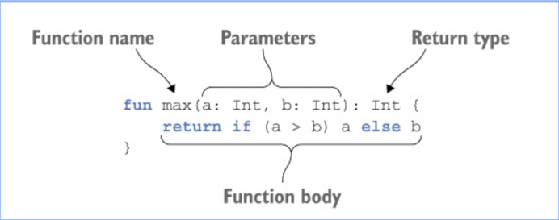

---
### 프로퍼티

자바에서는 필드와 접근자를 묶어서 프로퍼티라 부르는데 코틀린은 프로퍼티를 언어 기본 기능으로 제공하며,
코틀린의 프로퍼티는 자바의 필드와 접근자 메소드를 완전히 대신한다.

클래스에서 프로퍼티를 선언할 때는 변수 선언하는 방법과 마찬가지로 읽기전용 val, 사용가능한 var 를 사용한다.

기본적으로 코틀린에서 프로퍼티를 선언하는 방식은 프로퍼티와 관련 있는 접근자를 선언하는 것이다. (읽기 전용과 사용가능한 것으로)

자바와 코틀린의 경우를 비교해보자.
~~~java
Person person new Person("Bob", "married");

person.getName();
person.isMarried();
~~~

~~~kotlin
val person  = Person("Bob","married")

println(person.name)
println(person.isMarried)
~~~

> Bob  
> married

둘다 실행결과는 동일하지만 코틀린이 좀 더 간결한 경우를 알 수 있다.

new 예약어를 사용하지않고 생성자 호출이 가능하며 프로퍼티 이름을 직접 사용해도 코틀린이 자동으로 게터를 호출해준다.

---
### 커스텀 접근자

~~~kotlin
class Rectangle(val width: Int, val height: Int) {
    val isSquare: Boolean
        get() {
            return width==height
        }
}

fun main() {
    val Rectangle = Rectangle(45,45)
    println(Rectangle.isSquare)
}
~~~

---
### 코틀린 함수의 특징

> - 함수를 선언할 때 fun 키워드를 사용한다.
> - 파라미터 이름 뒤에 해당 파라미터 타입을 사용한다.
> - 함수를 최상위 수준에 정의할 수 있다. -> 꼭 클래스 안에 함수를 넣어야 할 필요가 없다.
> - 배열도 일반적인 클래스와 마찬가지로 코틀린에는 자바와 달리 배열 처리를 위한 문법이 따로 존재하지 않는다.
> - System.out.println() -> println() 으로 사용하며
    코틀린 표준 라이브러리는 여러가지 표준 자바 라이브러리 함수를 간결하게 사용할 수 있게 래퍼를 제공한다.
> - 최신 프로그래밍 언어 경향과 마찬가지로 줄 끝에 세미콜론 ; 을 붙이지 않아도 된다.

---
#### 
 max 

~~~kotlin
fun main() {
    println(max(5,3))
}

fun max(a: Int, b: Int): Int {
    return if(a>b) a else b
}
~~~

  
출처 : https://thxall92.medium.com/kotlin-코틀린-기초-b10faa5a23fc

fun 함수이름을 선언하고 자바랑 다르게 괄호안에 (변수명 : 자료형) : 리턴타입 이렇게 구성되어 있는 것을 확인 할 수 있다.  
if (a > b) a else b 는 자바의 삼항 연산자로 작성한 식과 비슷하다.

별로 자바와 크게 다른 것이 없어 보이지만 코틀린은 여기서 더 간결하게 문장을 만들수 있다.

~~~kotlin
fun max(a : Int, b: Int) : Int = if (a > b) a else b
~~~

여기서 반환 타입이 생략되었는데 실제로 모든 변수나 모든 식에는 타입이 있고 , 모든 함수는 반환 타입이 정해져야하지만
식이 본문인 함수의 경우 굳이 사용자가 반환 타입을 적지 않아도 컴파일러가 함수 본문 식을 분석해서 식의 결과를 함수 반환 타입으로 정해준다고 한다.

---
### 변수

코틀린에서는 타입 지정을 생략하는 경우가 흔한데 식과 변수의 선언을 구별하기 힘들다. 그런 이유로 코틀린에서는 키워드로 변수 선언을 시작하는 대신
변수 이름뒤에 타입을 명시하거나 생략하게 허용한다.

- val : 변경 불가능한 참조를 저장하는 변수이다. 자바로 따지만 final 변수에 해당된다.
- var : 변경 가능한 참조이며, 자바에서는 일반 변수에 해당한다.

~~~kotlin
fun test() {
     val a : Int = 4
     val b = 10

     println(a)
     println(b)
}
~~~

초기화 식을 사용한다면 타입을 지정하지 않아도 되지만 val answer 이렇게 되면 컴파일러가 타입을 추론하지 못하게 된다.

책의 필자는 기본적으로 모든 변수를 val 예약어를 사용해 불변 변수로 선언하고, 나중에 필요한 경우에만 var로 변경하는 걸 추천하고있다.

val 참조 자체는 불변이라도 그 참조가 가리키는 객체의 내부 값은 변경될 수 있다. 이는 자바의 final 속성과도 같다.

var 예약어를 사용하면 변수의 값을 변경할 수 있지만 타입은 고정되어 바뀌지 않는다.

---
### 문자열 템플릿

문자열 템플릿은 변수를 선언하고 그 다음 줄에 있는 문자열 리터럴 안에서 그 변수를 사용한다.

~~~kotlin
fun main() {
    val str = "Hello"
    print("Hi , $str")
}
~~~
자바의 문자열 접한 연산 ("Hi ," + str)과 동일한 기능이다.  
컴파일러가 검사하기 때문에 존재하지 않는 변수는 당연히 오류가 나며 print("Hi , \$str") 하면 $str 이라고 출력이 된다. 
복잡한 식 같은 경우 {}로 두러써서 문자열 템플릿 안에 넣을 수 있다.

---
### enum

코틀린에서 enum 은 자바 선언보다 더 많은 키워드를 써야하며 자바와 다르게 enum class 를 사용한다.  
class와는 다르게 enum은 소프트 키워드라서 키워드와는 다르게 다른 곳에 이름으로 사용할 수 있다.

~~~kotlin
enum class Color (val r: Int, val g : Int, val b : Int){
    RED(255,0,0),
    ORANGE(255,165,0),
    YELLOW(255,255,0),
    GREEN(0,255,0),
    BLUE(0,0,255),
    INDIGO(75,0,130),
    VIOLET(238,130,238);

    fun rgb() = (r * 256 + g) * 256 + b

}

fun main() {
    println(Color.BLUE.rgb())
}
~~~

#### 실행결과

> 255

enum에서도 생성자와 프로퍼티를 선언하며 해당하는 상수에 프로퍼티 값을 지정해야만 한다.
특이한 점은 enum 클래스 안에 메소드를 정의하는 경우 반드시 enum 상수 목록과 메소드 사이에 세미콜론을 넣어야한다.

---
### when

쉽게 말하면 자바의 switch 문과 같은 구성요소를 가지고 있다.
다른점은 자바와 달리 각 분기의 끝에 break 를 넣지 않아도 매치되는 분기를 찾으면 실행한다.  
한 분기 안에서 여러 값을 매치 패턴으로 사용하려면 ,(콤마)를 사용하여 값 사이를 분리하면 된다.

~~~kotlin
fun getColor(color: Color) = when (color) {
    Color.RED, Color.ORANGE, Color.YELLOW -> "warm"
    Color.GREEN, Color.BLUE -> "neutral"
    Color.INDIGO, Color.VIOLET -> "Cool"
}

fun main() {
    println(getColor(Color.ORANGE))
    println(getColor(Color.GREEN))
    println(getColor(Color.VIOLET))
}
~~~

#### 실행결과

> warm  
neutral  
Cool

when은 switch 달리 분기 조건의 임의의 객체를 허용한다.

#### 
 예시 

~~~kotlin
fun mix(c1: Color, c2: Color) =
    when (setOf(c1, c2)) {
        setOf(Color.RED,Color.BLUE) -> Color.GREEN
        setOf(Color.RED,Color.YELLOW) -> Color.ORANGE
        setOf(Color.YELLOW,Color.BLUE) -> Color.INDIGO

        else -> throw Exception("Dirty Color")
    }
~~~

#### 실행결과

> GREEN  
 Exception in thread "main" java.lang.Exception: Dirty Color 

c1,c2 가 혼합한 결과를 보여줄 수 있으며 이를 구현하기 위해 (Set)집합 비교를 사용한다.  
when 은 인자 값과 매치하는 조건을 찾을 때까지 각 분기를 검사하며 조건에 없는 경우
else -> 로 분기의 문장을 실행한다.
when의 분기 조건 부분에 식을 넣을 수 있다는 점이 코드를 더 간결하게 작성할 수 있다.

---